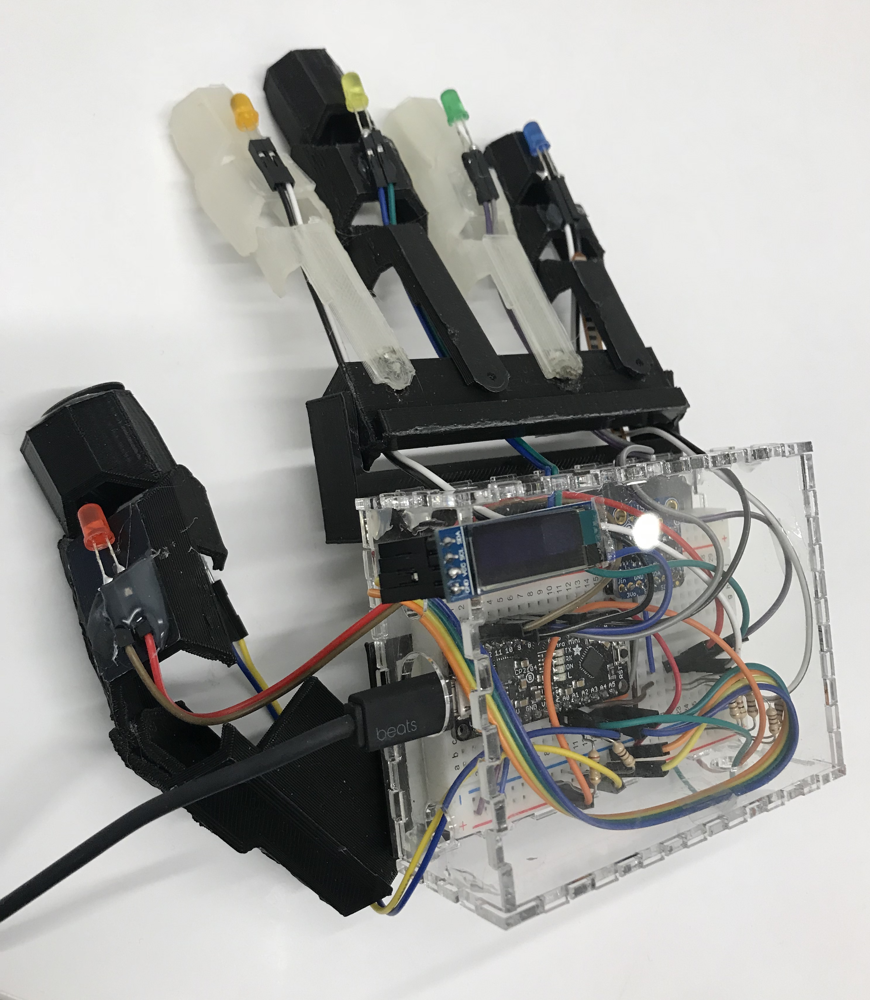
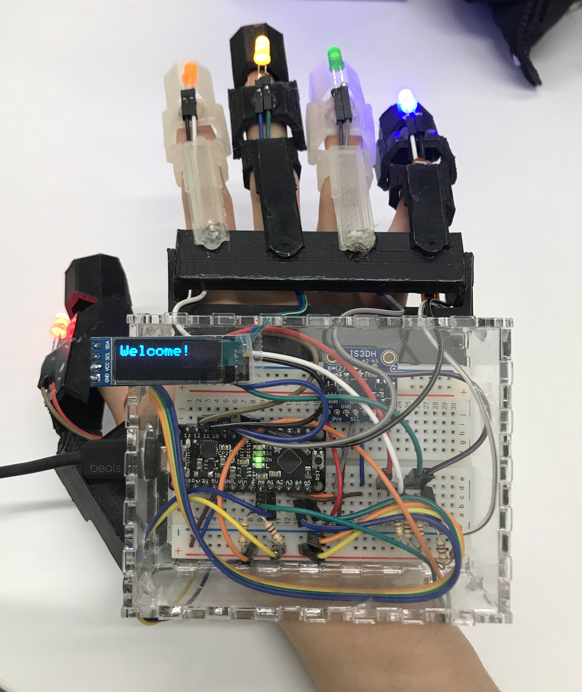
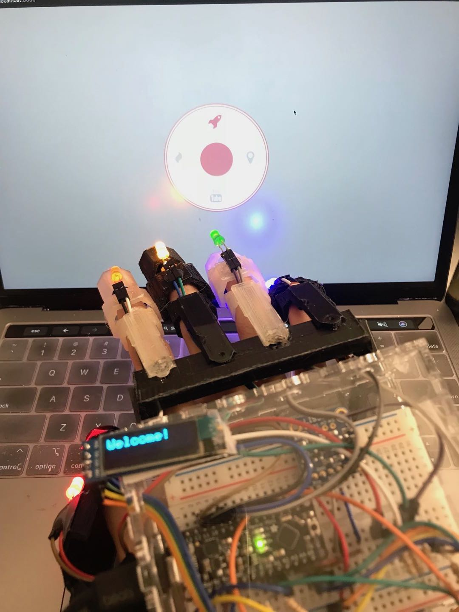
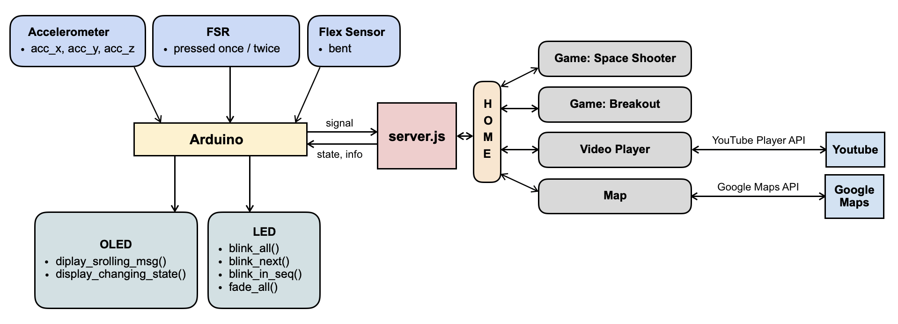
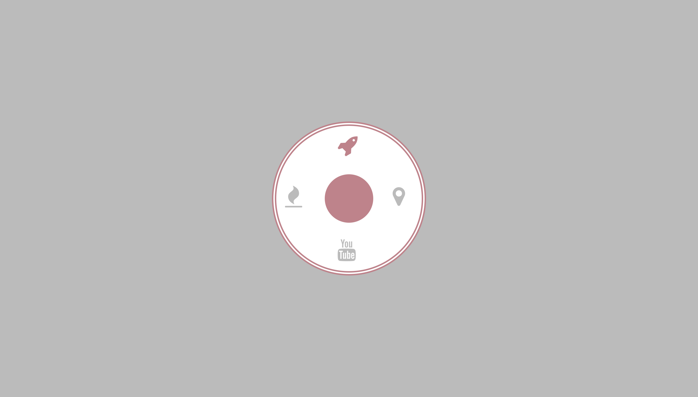
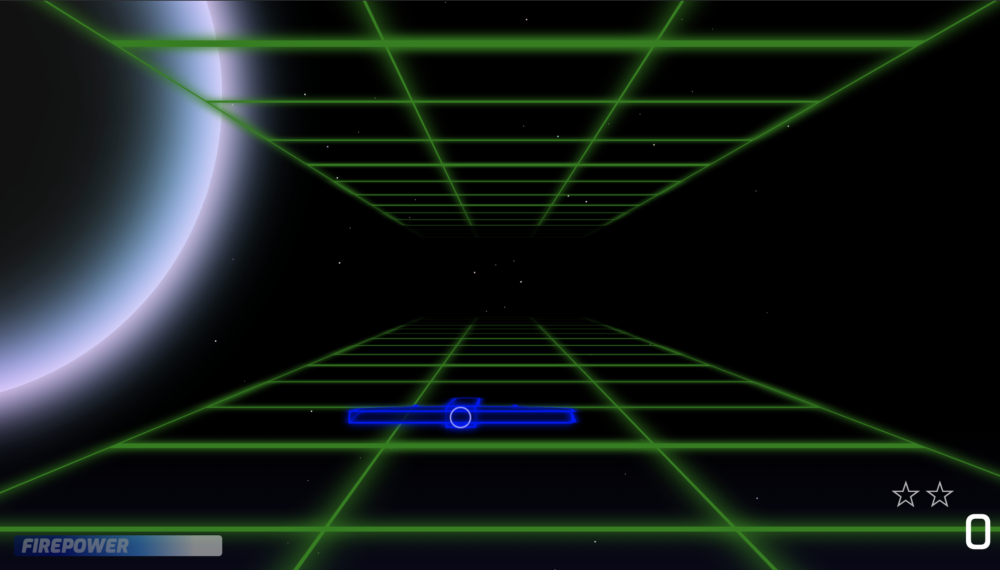
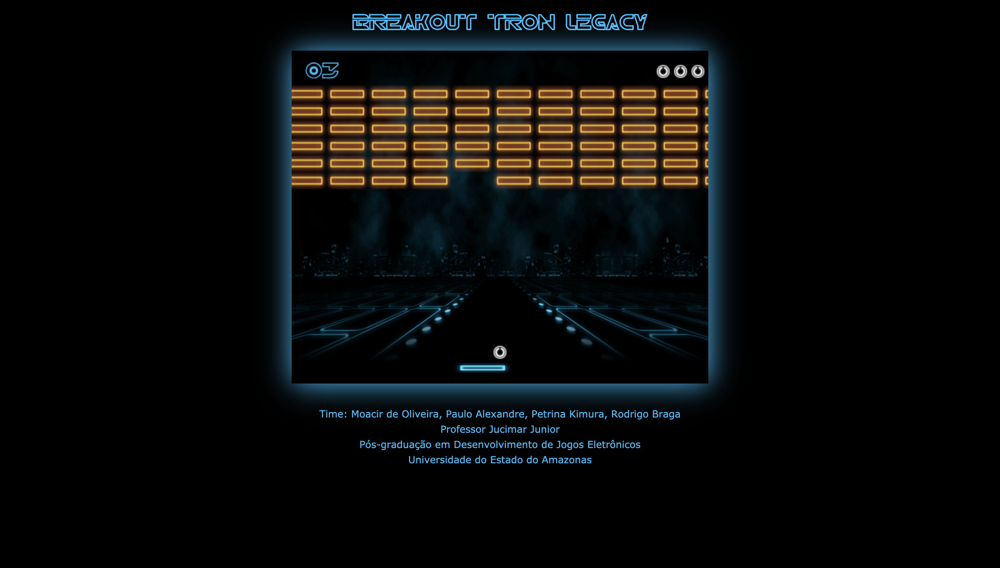
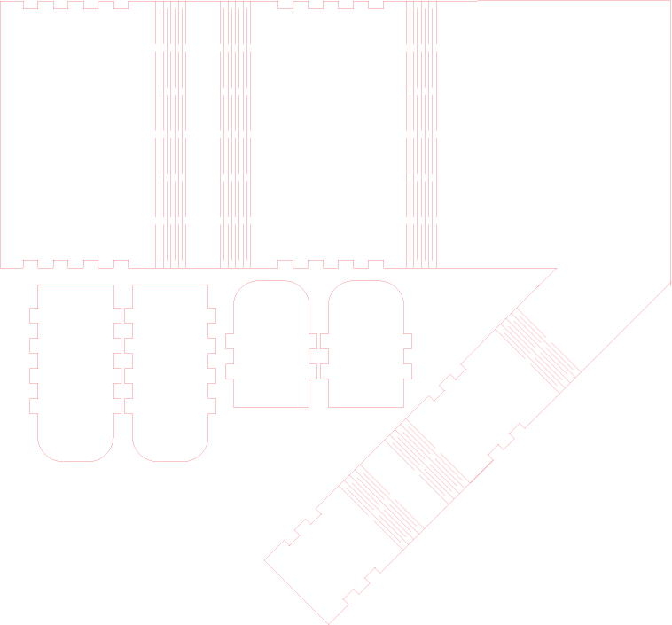
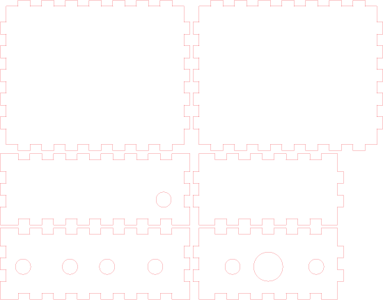

# Interactive Gauntlet

A more engaging way to play with web apps. 
<!--An interactive gauntlet for users to play around with different web apps in a more engaging way. -->

## Project Overview

### Project Idea 
	
Everyday we use keyboard and mouse to interact with web pages. This is fast and convenient, but less fun, especially for gaming and entertainment websites.
	
Our idea is to build an interactive gauntlet with Arduino. It helps create a better experience for us to play with web pages. The gauntlet allows users to interact with the web apps (video games, Youtube, Google Maps) hosted by our entertainment server using hand gestures. By putting on the gauntlet, you can explore the Internet in a more fun and engaging way!


#### Team

Yixue Wang (yw2224), Bo Fang (bf366)

#### The Gauntlet








## Design Destails

#### Components 
- Arduino
- Accelerometer × 1
- FSR × 1
- Flex Sensor × 1
- OLED × 1
- LEDs × 5
- Resistors × 7
 
#### Architecture


#### Iterations

- Paper Prototype


- Sensors & 3D Printed Gautlet


- Displays & Laser Cut Box Added 


- Final Iteration


## Usage and Functionality

### Home Page


We create an entertainment hub using Node.js. Once the server is started and the gauntlet connected, all five LEDs light up and the OLED shows a welcome message. We currently have four apps on our website menu that you can select from. Bend your fingers to select and tap to enter. You can always return to the home page by tapping your fingers twice.  Everytime the state changes (select an app or return to home page), the LEDs blink and the OLED displays different instruction messages. 

### Game: Space Shooter


Rotate your hand to control the space ship to go up / down / left / right. Bend your finger to shoot the enemies. Tap once to pause or resume.

### Game: Breakout


Rotate your hand to control the board to go left / right. Tap once to resume.

### Youtube Video Player


Rotate your hand, left / right for fast backward / forward, up / down for volume control. Bend your finger to pause or start a video. Tap once to play the next video, three times for previous video. The OLED displays the name of the current playing video.

### Google Maps


Rotate your hand to change directions to hover over the landscape. Bend to zoom in. Tap to zoom out. The OLED shows the current coordinate of the center of the map.

### Video Demo
[](https://youtu.be/CdNYkX-UDMU)

## Codes and Files

### Laser Cut



[Glove](./Media/Glove.ai)



[Box](./Media/BoxV2.ai)

### 3D Printing


[Gauntlet](./Media/FullPrint_Gauntlet.jpg)


### Arduino

[Arduino Code](./Code/arduino/arduino.ino)


```c++
#include <Wire.h>
#include <SPI.h>
#include <Adafruit_LIS3DH.h>
#include <Adafruit_Sensor.h>
#include <Adafruit_GFX.h>
#include <Adafruit_SSD1306.h>

enum APP {HOME, YOUTUBE, MAP, SHOOTER, BREAKOUT};
APP app;

// LED
#define RED 11
#define ORANGE 10
#define YELLOW 9
#define BLUE 8
#define GREEN 7
#define LEDS_NUM 5
int LEDS[] = {RED, ORANGE, YELLOW, BLUE, GREEN};
int cur_led = 0;

void blink_all() {
  for(int i = 0; i < LEDS_NUM; i ++){
    digitalWrite(LEDS[i], HIGH);  
  }
  delay(2000);
  for(int i = 0; i < LEDS_NUM; i ++){
    digitalWrite(LEDS[i], LOW);  
  }
}

void blink_one() {
  int prev_led = cur_led == 0 ? 4 : cur_led - 1;
  digitalWrite(LEDS[prev_led], LOW);
  digitalWrite(LEDS[cur_led], HIGH);
  cur_led = (cur_led + 1) % LEDS_NUM;
}

void fade_all() {
  for (int i = 0; i < LEDS_NUM; ++ i) {
    digitalWrite(LEDS[i], LOW);
  }
}

void blink_seq() {
  fade_all();
  for (int i = 0; i < LEDS_NUM; ++ i) {
    blink_one(); delay(300);
  }
  fade_all();
}

void setup_led() {
  for(int i = 0; i < LEDS_NUM; i ++){
    pinMode(LEDS[i], OUTPUT);
  }
  blink_all();
}
    
// OLED
#define SCREEN_WIDTH 128 
#define SCREEN_HEIGHT 32 
#define OLED_RESET     4 
Adafruit_SSD1306 display(SCREEN_WIDTH, SCREEN_HEIGHT, &Wire, OLED_RESET);
String message = "Welcome!";
String home_page = "Bend your fingers to select. Tap to enter. Tap twice to return.";
String youtube = "Left / right for fast backward / forward. Up / right for volume control. Tap to go to next / previous video. Bend to pause / start.";
String google_map = "Bend to zoom in. Tap to zoom out. Rotate to hover.";
String shooter = "Tap to start or pause. Bend to trigger. Move to fly.";
String breakout = "Rotate to move left / right.";
int x, minX;

void setup_display() {
  display.begin(SSD1306_SWITCHCAPVCC);
  display.setTextSize(2);
  display.setTextColor(WHITE);
  display.setTextWrap(false);
  display.display();
  delay(2000);
  display.clearDisplay();
  display.print("Welcome!");
  display.display();
  delay(2000);
  message = home_page;
  x = display.width();
  minX = -12 * message.length();
}

void display_fixed_msg(String msg) {
  display.clearDisplay();
  display.setCursor(0, 1);
  display.print(msg);
  display.display();
}

bool display_state_change(String str) {
  bool state_changed = true;
  if (str == "HOME") {
    app = HOME;
    message = home_page;
  } else if (str == "YOUTUBE") {
    app = YOUTUBE;
    message = youtube;
  } else if (str == "MAP") {
    app = MAP;
    message = google_map;
  } else if (str == "SHOOTER") {
    app = SHOOTER;
    message = shooter;
  } else if (str == "BREAKOUT") {
    app = BREAKOUT;
    message = breakout;
  } else {
    state_changed = false;
  }
  return state_changed;
}

void display_scrolling_msg() {
  display.clearDisplay();
  display.setCursor(x, 0);
  display.print(message);
  display.display();
  x -= 2;
  if(x < minX) x = display.width();

  if (Serial.available() > 0) {
    String tmp_msg = Serial.readString();
    Serial.println("msg_from_node" + tmp_msg);
    if (!display_state_change(tmp_msg)) {
      message = tmp_msg;
      x = display.width();
      minX = -12 * message.length();
    } else {
      Serial.println("changed");
      led_oled_change_state();
      delay(700);
    }
  }
}

void led_oled_change_state(void) {
  display.clearDisplay();
  for(int16_t i=0; i<display.height()/2; i+=3) {
    display.fillRect(i, i, display.width()-i*2, display.height()-i*2, INVERSE);
    display.display(); 
    delay(1);
  }
  delay(500);
  blink_seq();
  blink_seq();
}

// ACCELEROMETER
#define COMMON_ANODEs
#define LIS3DH_CLK 13
#define LIS3DH_MISO 12
#define LIS3DH_MOSI 11
#define LIS3DH_CS 10
Adafruit_LIS3DH lis = Adafruit_LIS3DH();
#if defined(ARDUINO_ARCH_SAMD)
  #define Serial SerialUSB
#endif

void setup_acc() {
  #ifndef ESP8266
    while (!Serial);    
  #endif
  if (!lis.begin(0x18)) {  
    Serial.println("Couldnt start");
    while (1);
  }
  lis.setRange(LIS3DH_RANGE_4_G);  
}

void process_acc() {
  lis.read();   
  sensors_event_t event; 
  lis.getEvent(&event);
  int acc_x = event.acceleration.x;
  int acc_y = event.acceleration.y;
  int acc_z = event.acceleration.z;
  Serial.print("acc,");
  Serial.print(acc_x); Serial.print(","); 
  Serial.print(acc_y); Serial.print(","); 
  Serial.println(acc_z);
}

// FSR
int fsrState = 0;
void process_fsr() {
  int fsr = analogRead(A1);
  if (fsr <= 20) {
    if (fsrState != 0) {
      Serial.print("fsr,");
      Serial.println(fsrState);
      fsrState = 0;
      return;
    }
  } else {
    fsrState += 1;
    if (fsrState > 3) fsrState = 3;
    delay(500);
    return;
  }
}

void process_flex() {
  int flex = analogRead(A0);
//  Serial.println(flex);
  if (flex < 150) {
    Serial.println("flex");
    if (app == HOME) blink_one();
    else if (app == SHOOTER) blink_seq();
    delay(500); 
    return;
  }
}

void setup() {
  Serial.begin(9600);
  setup_display();
  setup_acc();
  setup_led();
  app = HOME;
}

void loop() {
  display_scrolling_msg();
  process_fsr();
  process_flex();
  process_acc();      
}
```


### Web Server

[Web Server Code](./Code/webhub/server.js)

## Future Works
- Use more sensors / input components to support different gestures.	
- Iterate on the physical design and displays to improve usability. 
- Integrate more web apps into our hub.


