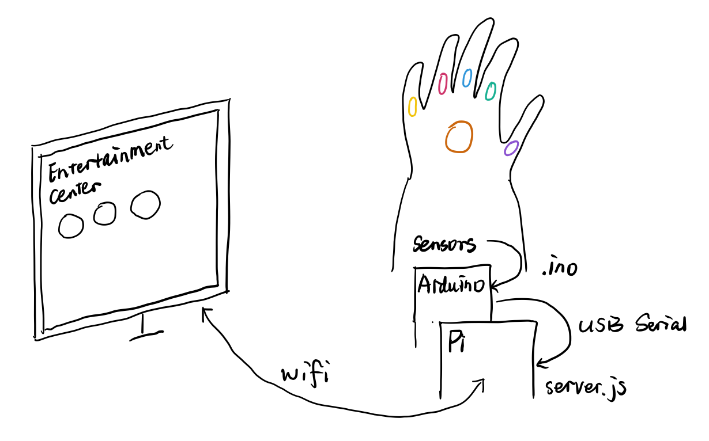

# Interactive Gauntlet 

A more engaging way to play with web apps.

## Project Idea

Everyday we use keyboard and mouse to interact with web pages. This is fast and convenient, but less fun, especially when we are wasting our time on cool websites.

So our idea is to build an interactive gauntlet (possibily) with Arduino and raspberry Pi. It helps create a better experience for us to play with different web apps. We plan to attach mulitple sorts of user inputs (sensors, buttons, microphones, etc) to the gauntlet. It then communicates via Arduino with web pages hosted by raspberry Pi. By putting on the gauntlet, you can explore the Internet in a more fun and engaging way!

## Team

Yixue Wang (yw2224), Bo Fang (bf366)

## Rough form: 

## Current Progress
- Space Shooter vs. Accelerometer & flex sensor

## Next Steps
- More sensors
	- FSR, buttons, microphones, camera... 

- More web apps 
	- Games, Videos, Earth, Painting...

- The Gauntlet (or?)
	- 3D printer / Laser cut

