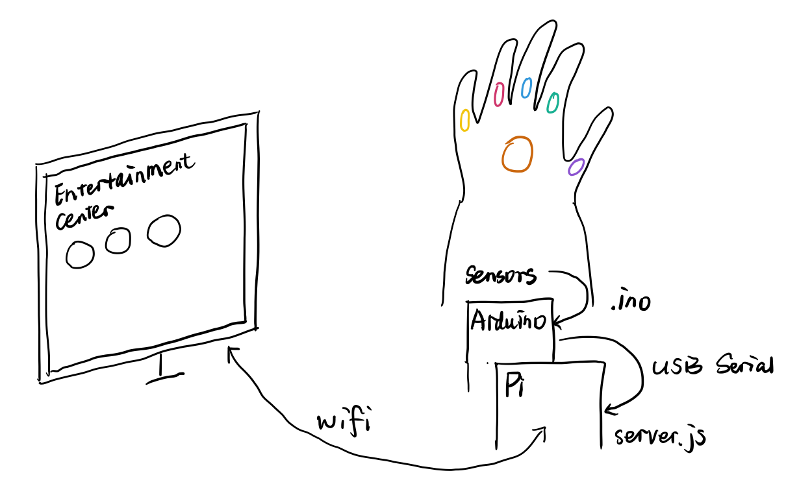
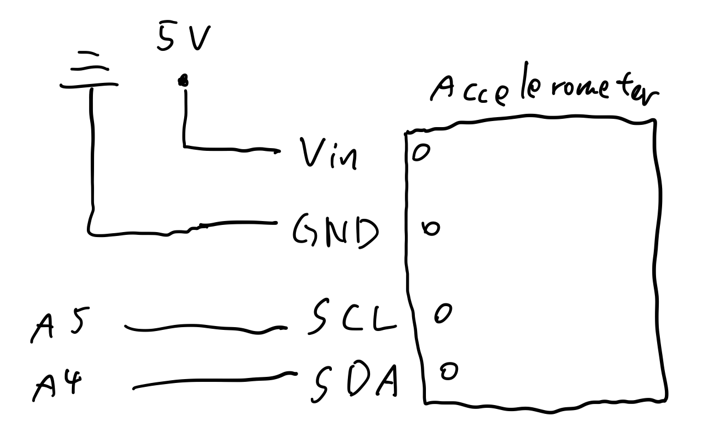

## Interactive Gauntlet

#### Project Idea

We are building an interactive gamepad with Arduino and raspberry Pi. We plan to host a web-based entertainment center, enable mulitple sorts of user inputs (sensors, buttons, microphones, etc) on our gamepad, and connect these two parts using Arduino and raspberry Pi. Users can play web games (and possibly other web apps) in more engaging ways.

#### Team

Yixue Wang (yw2224), Bo Fang (bf366)

#### Rough form: this is your paper prototype (put photos on your GitHub, bring the actual thing to class)

#### Expected parts: is there a display, a motor, batters, interface, etc? Where does the Pi/Arduino/other controller go?

- Display (We plan to use raspberry Pi to host a web-based entertainment hub)
- Batteries (to power Pi and Arduino wirelessly)
- Input components: accelerometer, flex sensors, buttons, microphones... 
- Arduino captures different input signals, And the inputs get transformed via Arduino, Pi, and finally to the web page the user is interacting with.

#### Interaction plan: how will people interact with your device?

We plan to integrate multiple interactions onto the gamepad, let users play web apps in a more engaging way. For example, users can 'pull the trigger' that is captured by flex sensors; control racing cars by moving their hand, which are detected by the accelerometer; or give orders directly via a microphone.
