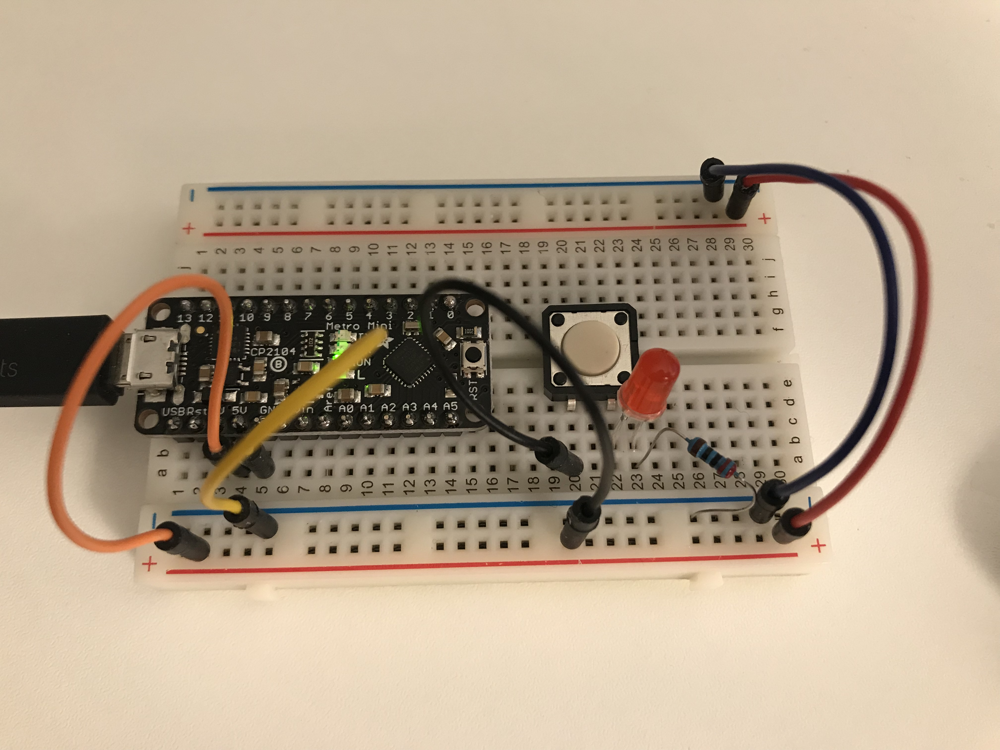
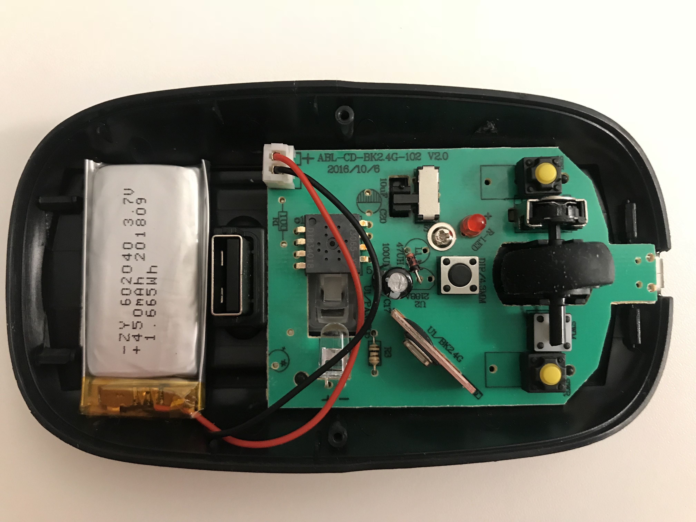
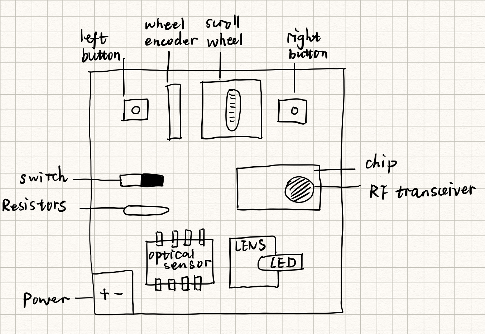

# IDD-Fa18-Lab1: Blink!

**yw2224@cornell.edu**

## Part A. Set Up a Breadboard




## Part B. Manually Blink a LED

**a. What color stripes are on a 100 Ohm resistor?**

Brown, black, red, and a tolerance color.
 
**b. What do you have to do to light your LED?**

Push the button to close the circuits.

## Part C. Blink a LED using Arduino

### 1. Blink the on-board LED

**a. What line(s) of code do you need to change to make the LED blink (like, at all)?**

No need to change as long as the LED is connected to the `LED_BUILTIN` pin (13).

**b. What line(s) of code do you need to change to change the rate of blinking?**

Change the time interval for the `delay()` function.

**c. What circuit element would you want to add to protect the board and external LED?**

Resistors.
 
**d. At what delay can you no longer *perceive* the LED blinking? How can you prove to yourself that it is, in fact, still blinking?**

At 13 milliseconds, it is hard for me to perceive the blinking. But the blinking can be captured by the slo-mo camera on my iPhone.

**e. Modify the code to make your LED blink your way. Save your new blink code to your lab 1 repository, with a link on the README.md.**

I changed the output pin and the blink frequency.

[Blink Code](./Code/blink/blink.ino)

```java
const int PIN = 11;

void setup() {
    pinMode(PIN, OUTPUT);
}

void loop() {
  int timeInterval = 500;
  digitalWrite(PIN, HIGH);     
  delay(timeInterval);                      
  digitalWrite(PIN, LOW);    
  delay(timeInterval);                      
}
```


### 2. Blink your LED

**Make a video of your LED blinking, and add it to your lab submission.**

[](https://youtu.be/ska8GsdIzkU)

## Part D. Manually fade an LED

**a. Are you able to get the LED to glow the whole turning range of the potentiometer? Why or why not?**

Yes. The LED is bright when the resistance is at a low level. It dims when the resistance grows higher, since less current can flow through.

[](https://youtu.be/cFtxn-jmhr4)

## Part E. Fade an LED using Arduino

**a. What do you have to modify to make the code control the circuit you've built on your breadboard?**

Connect my chosen pin 11 to the LED.

**b. What is analogWrite()? How is that different than digitalWrite()?**

`analogWrite()` writes an analog value (PWM wave) to a pin with a value between 0 and 255. Thus it can be used to light a LED at varying brightnesses. `digitalWrite()` only allows a `HIGH` and a `LOW` output.

By giving `analogWrite()` a continously increasing value, I was able to fade the LED using Arduino.

```java
const int PIN = 11;
int count;

void setup() {
  pinMode(PIN, OUTPUT);
  count = 0;
}

void loop() {
  count= (count + 1) % 255;
  analogWrite(PIN, count);  
  delay(10);
}
```

[Fade Code](./Code/blink/auto-fade.ino)

[](https://youtu.be/oPld3M6-sVo)


## Part F. FRANKENLIGHT!!!

### 1. Take apart your electronic device, and draw a schematic of what is inside. 

I tore apart a bluetooth mouse:




**a. Is there computation in your device? Where is it? What do you think is happening inside the "computer?"**

Yes. The small micro-controller in the mouse needs to convert the input analogue signals (captured by the left and right buttons, the scroll wheel and the optical sensor tracking movements of the mouse) to digital signals and transfer the data to computers using bluetooth.

**b. Are there sensors on your device? How do they work? How is the sensed information conveyed to other portions of the device?**

Yes. The button clicks is an on-and-off switch and the processor then knows which port (left/right/middle) the signal comes from. The optical sensor senses and stores image pixels through the lens. The movement of the mouse can then be computed by comparing the pixel differences between two serial images.

**c. How is the device powered? Is there any transformation or regulation of the power? How is that done? What voltages are used throughout the system?**

It’s powered by a rechargeable battery of 3.7V. There are resistors regulating the power.

**d. Is information stored in your device? Where? How?**

The image pixels sensed by the optical sensor need to be stored to enable hardware to perform signal processing on the data.

### 2. Using your schematic, figure out where a good point would be to hijack your device and implant an LED.

**Describe what you did here.**

There is already an LED light inside the mouse indicating whether the mouse is on or off. I connected my LED to that built-in one in parallel so that they can work at the same time.

### 3. Build your light!

**Make a video showing off your Frankenlight.**

[](https://youtu.be/Lu6_qr5A7qU)
