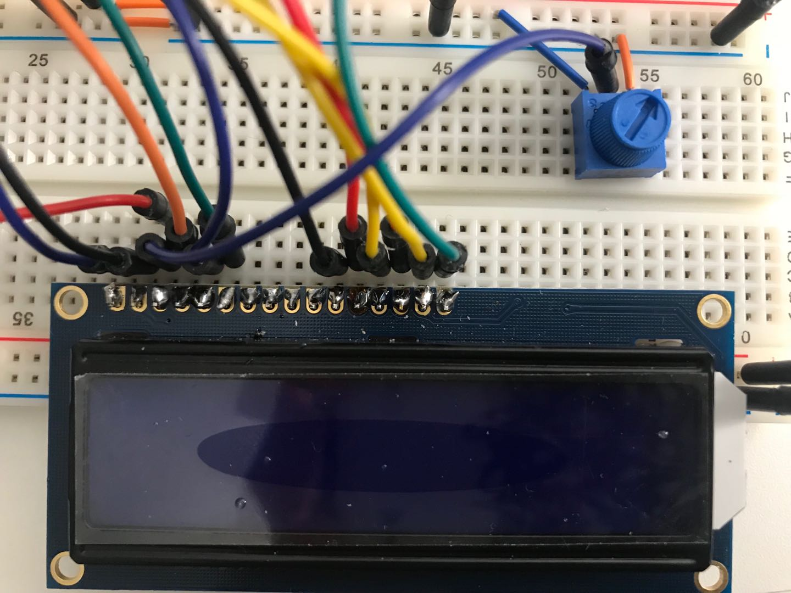

# Digital Timer
 
yw2224@cornell.edu

## Part A. Solder your LCD panel

**Take a picture of your soldered panel and add it here!**



## Part B. Writing to the LCD
 
**a. What voltage level do you need to power your display?**

5V.

**b. What voltage level do you need to power the display backlight?**

3.3V.
   
**c. What was one mistake you made when wiring up the display? How did you fix it?**

I forgot to connect the two vertically separate sections in the long breadboard. So the circuit was not closed and the LCD got no power. Conneting the breaks in the breaboard solved the problem.

**d. What line of code do you need to change to make it flash your name instead of "Hello World"?**

```java
lcd.print("Hello, Yixue!");
```
 
**e. Include a copy of your Lowly Multimeter code in your lab write-up.**

```java
#include <LiquidCrystal.h>
LiquidCrystal lcd(12, 11, 5, 4, 3, 2);

// Analog values
int sensorPin = A0;    // select the input pin for the potentiometer
int sensorValue = 0;  // variable to store the value coming from the sensor

void setup() {
  lcd.begin(16, 2);
}

void loop() {
  sensorValue = analogRead(sensorPin);
  lcd.clear();
  lcd.print(sensorValue);
  delay(500);
}
```

[](https://youtu.be/AQTcf3IKWQo)

[Multimeter Code](./Code/multimeter/multimeter.ino)

## Part C. Using a time-based digital sensor

**Upload a video of your working rotary encoder here.**

[](https://youtu.be/AIF6YPL5TDo)

## Part D. Make your Arduino sing!

**a. How would you change the code to make the song play twice as fast?**

Double each value in `int noteDurations[]`.
 
**b. What song is playing?**

Starwars theme song.


## Part E. Make your own timer

**a. Make a short video showing how your timer works, and what happens when time is up!**

You can set the countdown time using the rotary encoder. Once you push the button, the timer starts counting down. It sings when time is up.

[](https://youtu.be/ojdZyJkpb_s)

**b. Post a link to the completed lab report your class hub GitHub repo.**