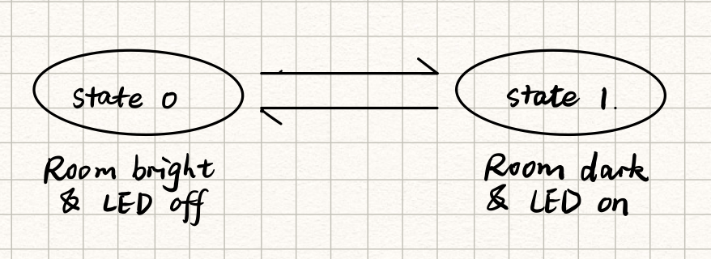

# Data Logger (and using cool sensors!)

yw2224@cornell.edu

For this lab, we will be experimenting with a variety of sensors, sending the data to the Arduino serial monitor, writing data to the EEPROM of the Arduino, and then playing the data back.

## Part A.  Writing to the Serial Monitor
 
**a. Based on the readings from the serial monitor, what is the range of the analog values being read?**

0 - 1023.
 
**b. How many bits of resolution does the analog to digital converter (ADC) on the Arduino have?**

10 bits.

## Part B. RGB LED

**How might you use this with only the parts in your kit? Show us your solution.**

[](https://youtu.be/4DGOmcBptkU)


## Part C. Voltage Varying Sensors 
 
### 1. FSR, Flex Sensor, Photo cell, Softpot

**a. What voltage values do you see from your force sensor?**

The reading from the serial monitor is 0 - 995 with a 10k resistor, which maps to 4.86V

**b. What kind of relationship does the voltage have as a function of the force applied? (e.g., linear?)**

Non-linear. There appears to be a logarithimic relationship.

**c. In `Examples->Basic->Fading` the LED values range from 0-255. What do you have to do so that you get the full range of output voltages from the LED when using your FSR to change the LED color?**

We can map the sensor output to the LED value range by using `map(output, 0, 1023, 0, 255);`.

**d. What resistance do you need to have in series to get a reasonable range of voltages from each sensor?**

I used a 10k resistor for all three sensors, and it seemed to be working fine.

<!--For the photoresistor, using five 1000 Ohm resistors in series (5k Ohms total), gave me a volage range from 2.25V-3.71V, which is sufficient using my if/else structure.

For the flex sensor resistor, I used the 10k Ohm resistor, which gave me an analog reading range from 0.49V-1.96V, which is sufficient using my if/else structure.

For the softpot, I used the 10k Ohm resistor, which gave me an analog reading range from 1.96V-5V, which is sufficient using my if/else structure.
-->

<!--
To get the full range of output voltages you can add resistors in series after the FSR. With a 10k resistor I seem to be able to get a range of about 500-1024 integer units, or ~2.5-5V for each sensor.
-->
**e. What kind of relationship does the resistance have as a function of stimulus? (e.g., linear?)**

For the FSR and Flex Sensor, there appears to be a logarithmic relationship. Photo cell and Softpot seem to be linear.

<!--For the photoresistor, there appears to be a linear relationship.

For the flex sensor resistor, there appears to be a logarithmic relationship.

For the softpot, different areas of the softpot map to different resistances.-->

<!--FSR & Flex Sensor appear to be logorithmic

Photo cell & softpot appear linear.-->

### 2. Accelerometer
 
**a. Include your accelerometer read-out code in your write-up.**

I modified the code to let both the LCD and RGB display the accelerometer readings:

```c++
  /* Display on lcd */ 
  lcd.setCursor(0, 0);
  lcd.print("X:" + String(event.acceleration.x));
  lcd.setCursor(9, 0);
  lcd.print("Y:" + String(event.acceleration.y));
  lcd.setCursor(0, 1);
  lcd.print("Z:" + String(event.acceleration.z));

  Serial.println();

  /* Display on RGB */ 
  if (lis.x > lis.y && lis.x > lis.z)
    setColor(255, 0, 0); // red
  if (lis.y > lis.x && lis.y > lis.z)
    setColor(0, 255, 0); // green
  if (lis.z > lis.y && lis.z > lis.x)
    setColor(0, 0, 255); // blue
```
[Full Acc Code](./Code/acc/acc.ino)


[](https://youtu.be/MgsBMxucT2E)

## Optional. Graphic Display

**Take a picture of your screen working insert it here!**

The graphic display shows the take-in analog values from the sensor.

```c++
void loop() {
  int val = analogRead(A0);
  Serial.println(val);
  testdrawsensorvalue(val);
}

void testdrawsensorvalue(int val){
  display.clearDisplay();
  
  display.setCursor(0,0);
  display.setTextSize(2);         
  display.setTextColor(WHITE);      
  display.println(val);
  display.display();
  
  delay(500);
}
```
[Full Graphic Code](./Code/sensor_to_graphic/sensor_to_graphic.ino)

[](https://youtu.be/oWT-2oVXSxc)

## Part D. Logging values to the EEPROM and reading them back
 
### 1. Reading and writing values to the Arduino EEPROM

**a. Does it matter what actions are assigned to which state? Why?**

Yes. The order of the states matters. Values of a potentiometer change continously. For example, you need to pass State 1 changing from State 0 to State 2. If we write some bytes in State 0, clean the data in State 1, nothing can be read in State 2.

**b. Why is the code here all in the setup() functions and not in the loop() functions?**

The loop() functions handles the switch between states, but not the operation for a particular state. We only need to setup() and run the code for a state when there is a state change triggered by the potentiometer.

**c. How many byte-sized data samples can you store on the Atmega328?**

1024.

**d. How would you get analog data from the Arduino analog pins to be byte-sized? How about analog data from the I2C devices?**

Byte-sized values are within a fixed range. We could use the `map` function to map the analog data to a byte's range. We could do the same mapping for the I2C devices. 

**e. Alternately, how would we store the data if it were bigger than a byte? (hint: take a look at the [EEPROMPut](https://www.arduino.cc/en/Reference/EEPROMPut) example)**

We can use put() to store data bigger than a byte. It takes the object to be stored and the address of the first byte as parameters. It then writes the object to the address taking up all the subsequent bytes needed.

**Upload your modified code that takes in analog values from your sensors and prints them back out to the Arduino Serial Monitor.**

```c++
Serial.println(map(analogRead(A0), 0, 1023, 0, 255));
```

[Full SensortoSerial Code](./Code/sensor_to_serial/sensor_to_serial.ino)

### 2. Design your logger
 
**a. Insert here a copy of your final state diagram.**


I designed an smart night light. The photo cell detects the brightness of the room. The LED automatically lights up when the room is dark, and goes off when it's bright.



### 3. Create your data logger!
 
**a. Record and upload a short demo video of your logger in action.**

[](https://youtu.be/0XEJ0P7Z5yc)

[AutoLight Code](./Code/auto_light/auto_light.ino)