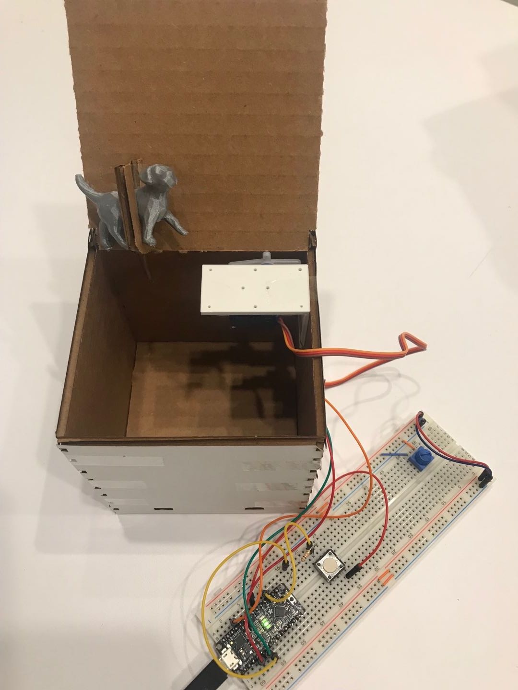

# Jack in the Box

yw2224@cornell.edu

For this week’s lab, we will be building a Jack in the box; this is a project inspired by the known toy. We will use this lab to help you to experiment with digital fabrication tools. The methods that will be used are 3D printing and laser cutting.

## Part A. Arduino code
 
[Arduino Code](./Code/box/box.ino)

## Part B. File for Your Jack 

[.slv File](./Media/dog.stl)

## Part C. Photo of Your Box

## Part D. Your Box in Action

