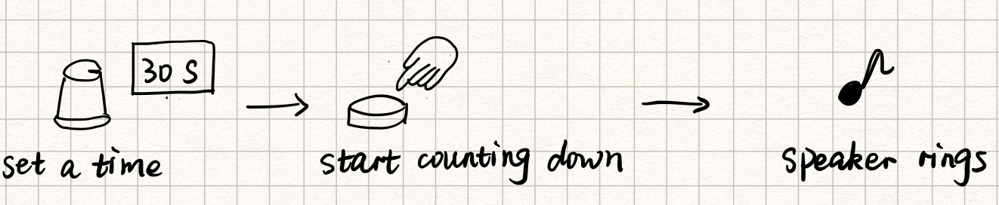

# preLab 02

**yw2224@cornell.edu**

**IDEA GENERATION: The point of this week's lab is to figure out a cool interaction that you can make possible with the timer capabilities of the micro controller. You could make a game where people have to try to press a button more times than their friend in a certain amount of time. You could make something that sings you to sleep, and gets quieter and quieter over 3 minutes. You could make something that you hit as you start to run down a hall, and then hit again, to see how fast you can run.**

**Please come up with 10 ideas of what you could do. They do not need to be potential market blockbusters. They do need to be things you feel like doing next week. You will also be asked to film one of your classmates trying out your idea, so pick things one of your classmates will be comfortable doing on film. Draw sketches with each of your ideas.**

1. A custom timer. Rotate the encoder to set a time. Press the button to start counting down. The speaker begins to play songs when the time is up.

	

2. A composer. For each note, rotate encoder1 to set the pitch, use encoder2 to set its duration. Then press button1 to "write down" the note. Repeat this process util you finish composing. Once completed, press button2 to let the speaker play your song.
	
	

3. A music player. Pre-store several songs to the Arduino. When playing, press the button to skip songs.

	
 
4. A lottery wheel. Initialize a variable with a secret value. Each participant takes turns to rotate the encoder. Each rotation decrease the value by one. When the variable becomes less than zero, the LED lights up. The first person to light up the LED wins the lottery!

	

5. Counting to 20 game. Two players take turns to press the button. Each person may press once, twice or three times per turn. Each time the button being pressed, the counter is increased by one. The LED lights up when the counter reaches 20. Whoever lights up the LED wins the game. 

	

6. Back-to-work alarm. Press the button to start the timer when you take a rest playing with your phone from studying. The alarm goes off after 10 minutes, reminding you to get back to work.  

	

7. Wake-up call. The timer sings to wake you up in the morning. If you fail to press the button to stop it, it will sing louder.

	

8. Who is faster?. Two players start to rotate their encoders at the same time. Whoever reaches 100 first wins the game. The speaker sings different tunes to indicate the winner.

	

9. Fitness supervisor. The timer monitors and ensures that you spend at least 30 minutes working out everyday.

	

10. QA master. The LCD displays a multiple-choice question. The participant presses one of the three buttons to choose from A, B and C. The correct answer should light up the LED.

	

