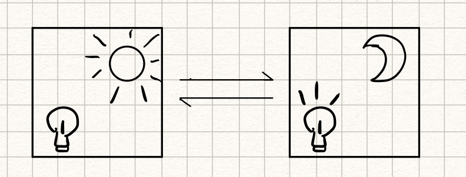
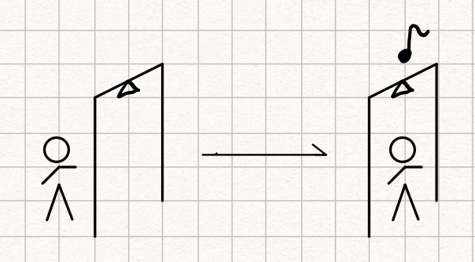
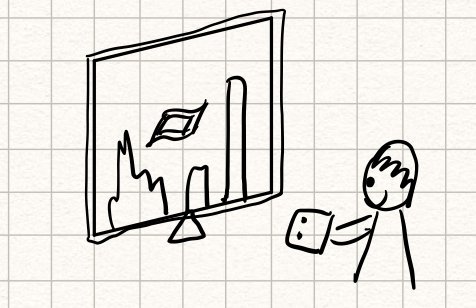

# preLab 03

**yw2224@cornell.edu**

**IDEA GENERATION: The point of this week's lab is to figure out a cool interaction that you can make possible with the a micro controller which can record data generated by a sensor, and then play it back. You could make programmable piano. You could make that records how much you toss and turn at night. You could make something that measures the changing light levels in your room.**

**Draw sketches with each of your ideas.**

1. A night light that automatically lights up when the room is dark.

	

	
2. A door bell that senses and rings if someone enters the room.
	
	

3. A magical carpet video game where the player uses a accelerometer to control his carpet in the game to fly across obstacles.

	
 
